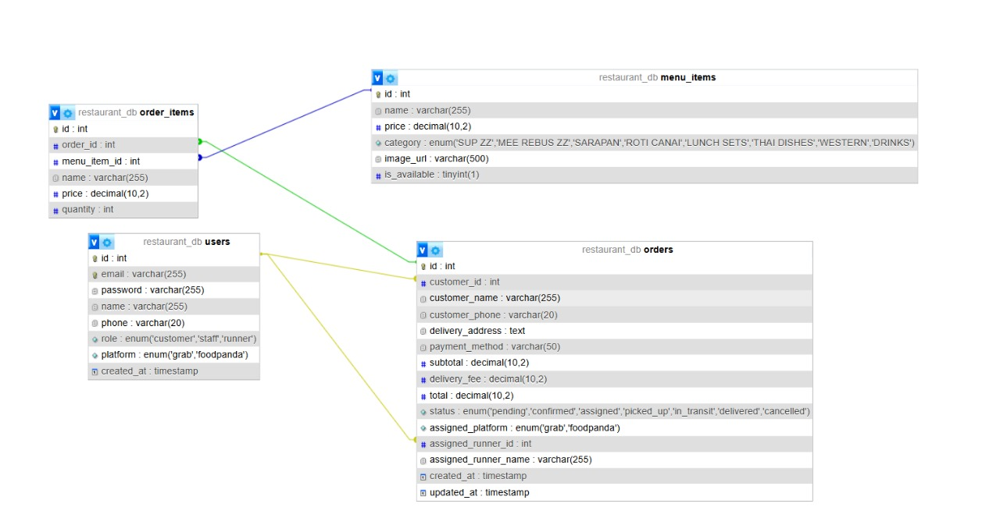

# ZZ Restaurant Ordering System - Documentation

## System Overview

The ZZ Restaurant Ordering System is a multi-role web application that facilitates the ordering and delivery process for ZZ Restaurant. The system supports three user roles:

1. **Customer**: Can browse the menu, place orders, and track order status
2. **Staff**: Can manage orders, confirm orders, assign to delivery platforms, and manage menu items
3. **Runner**: Can pick up orders assigned to their platform (GRAB or Food Panda) and update delivery status

## Technical Implementation

### Technology Stack
- **Frontend**: HTML, CSS, Vanilla JavaScript
- **Backend**: PHP and MySQL
- **Design**: Yellow-beige theme (#F5E6C4 background, #333333 text, #D62828 accent)

### Database Structure
The system uses a MySQL database with the following tables:
- `users`: Stores user accounts for all roles (customer, staff, runner)
- `menu_items`: Stores restaurant menu items with categories
- `orders`: Stores order information and status
- `order_items`: Stores individual items within each order




### System Architecture 
+----------------+       +------------------+       +------------------+
|  Customer App  | <---> |                  | <---> |   MySQL Database |
|  (Frontend)    |       |    PHP Backend   |       |                  |
+----------------+       |   (api.php etc.) |       +------------------+
                         |                  |
+----------------+       +------------------+
| Staff App      |
| (Frontend)     |
+----------------+

+----------------+       
| Runner App      |
| (Frontend)     |
+----------------+

### File Structure
```
/restaurant-system
├── index.html (login page)
├── customer.html (customer dashboard)
├── staff.html (staff dashboard)
├── runner.html (runner dashboard)
├── css/
│   └── styles.css (global styles)
├── js/
│   ├── auth.js (authentication functions)
│   ├── customer.js (customer dashboard functionality)
│   ├── staff.js (staff dashboard functionality)
│   └── runner.js (runner dashboard functionality)
├── php/
│   ├── config.php (database connection)
│   ├── auth.php (login/logout)
│   ├── menu.php (menu operations)
│   ├── orders.php (order operations)
|   |── user.php (user operations)
│   ├── api.php (general API endpoints)
│   ├── email_templates.php
│   └── database_setup.php (database initialization)
└── images/
    └── menu/ (food images)
```


### API Documentation 

| Endpoint                                             | Method | Description              |
| ---------------------------------------------------- | ------ | ------------------------ |
| `php/api.php?action=create_order`                    | POST   | Submit a new order       |
| `php/api.php?action=get_order_details&order_id={id}` | GET    | Retrieve order details   |
| `php/api.php?action=list_orders`                     | GET    | Fetch all orders (admin) |
| `php/api.php?action=update_status`                   | POST   | Update order status      |
| `php/api.php?action=login`                           | POST   | User/Admin login         |
| `php/api.php?action=register`                        | POST   | Customer registration    |

Endpoint: /php/api.php?action=create_order

Method: POST

Body:

{
  "user_id": 3,
  "items": [
    { "menu_id": 1, "quantity": 2 },
    { "menu_id": 4, "quantity": 1 }
  ],
  "delivery_address": "Jalan ABC, Melaka"
}

Success Response:
{ "success": true, "order_id": 23 }

Error Response:
{ "success": false, "message": "Invalid items" }


### Frontend App Descriptions 

Customer App
    Purpose: For users to browse, order, and track food.

    Tech Stack: HTML, JS

    API Use: Calls /api.php to get menu, place order, get status.

Staff/Runner App
    Purpose: For restaurant staff to manage orders and runners to deliver.

    Tech Stack: HTML, JS

    API Use: Manage menu, confirm/assign orders, update statuses.
## Features and Workflows

### Authentication
- Login system for all user roles
- Registration for new customers
- Role-based redirection to appropriate dashboards
- Session management for secure access

### Customer Features
- Browse menu items by category
- Add items to cart
- Place orders with delivery details
- View order history and track current orders
- Real-time order status updates

### Staff Features
- View and manage pending orders
- Confirm or cancel orders
- Assign orders to delivery platforms (GRAB or Food Panda)
- View all orders with status filtering
- Manage menu items (add, edit, toggle availability)

### Runner Features
- View orders assigned to their platform
- Pick up available orders
- Update delivery status (picked up → in transit → delivered)
- View delivery history

## Order Workflow

1. Customer places order → Status: 'pending'
2. Staff confirms order → Status: 'confirmed'
3. Staff assigns to platform → Status: 'assigned' + platform info
4. Runner picks up → Status: 'picked_up' + runner info
5. Runner starts delivery → Status: 'in_transit'
6. Runner completes delivery → Status: 'delivered'

## Data Validation

### Frontend Validation
- Required fields (name, email, password, delivery address)
- Email format validation
- Disable order button if cart is empty

### Backend Validation
- SQL input sanitization (using `mysqli_real_escape_string`)
- Password hashing using `password_hash()`
- Unique email enforcement


## Security Features

- Password hashing for user accounts
- Input sanitization to prevent SQL injection
- Session-based authentication
- Role-based access control for API endpoints
- Form validation on both frontend and backend

## Responsive Design

The system is fully responsive and works on both desktop and mobile devices:
- Flexible layouts that adapt to screen size
- Mobile-friendly navigation
- Touch-friendly interface elements
- Consistent user experience across devices

## Installation and Setup

1. Place the entire `restaurant-system` folder in your web server's document root
2. Create a MySQL database named `zz_restaurant`
3. Update database credentials in `php/config.php` if needed
4. Access the database setup script at `http://your-server/restaurant-system/php/database_setup.php` to initialize the database
5. Access the system at `http://your-server/restaurant-system/`

## Default User Accounts

The system comes with the following pre-configured user accounts:

| Role     | Email               | Password |
|----------|---------------------|----------|
| Customer | customer@demo.com   | password |
| Staff    | staff@demo.com      | password |
| Runner   | grab@demo.com       | password |
| Runner   | foodpanda@demo.com  | password |


## Maintenance and Customization

- To add new menu items: Log in as staff and use the menu management interface
- To modify the design: Edit the CSS in `css/styles.css`
- To add new features: Extend the JavaScript files and PHP API endpoints as needed
